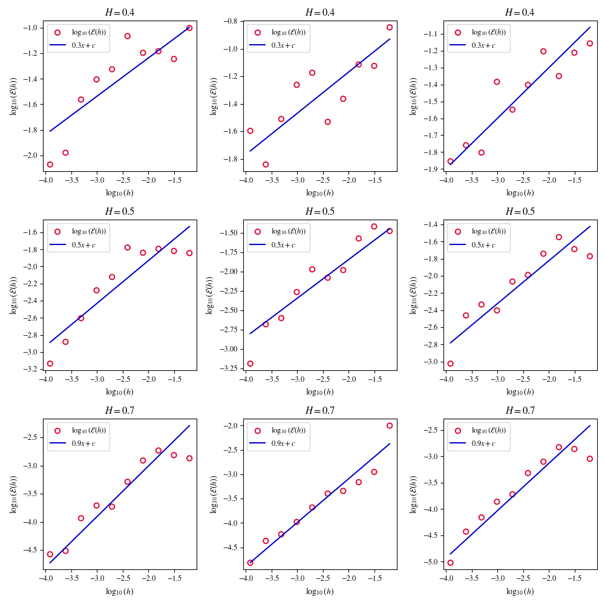

This directory contains code reproducing the results found in the paper
"Runge-Kutta methods for rough differential equations" [[Redmann & Riedel, 2020](#reference)]. 
The authors apply Heun's method to the RDE

```math
dy(t) = \cos(y(t)) d\mathbf{X}^1(t) + \sin(y(t))d\mathbf{X}^2(t), \quad y(0) = 1, \quad t \in [0,T].
```

where $\mathbf{X}$ is a two-dimensional fractional Brownian motion
with independent components and Hurst index H. The error

```math
\mathcal{E}(h) := \max_{k = 0, \ldots, N} |y(t_k) - y_k^h|
```
is then evaluated for different choices of the step size $h$, and
the trends are compared against the expected order of convergence, $2H - 0.5$.
For more details, see [[Redmann & Riedel, 2020](#reference)].

<p align="center">

</p>

## References
<a name="reference"></a>
- Redmann, M., & Riedel, S. (2020). Runge-Kutta methods for rough differential equations. arXiv preprint arXiv:2003.12626.